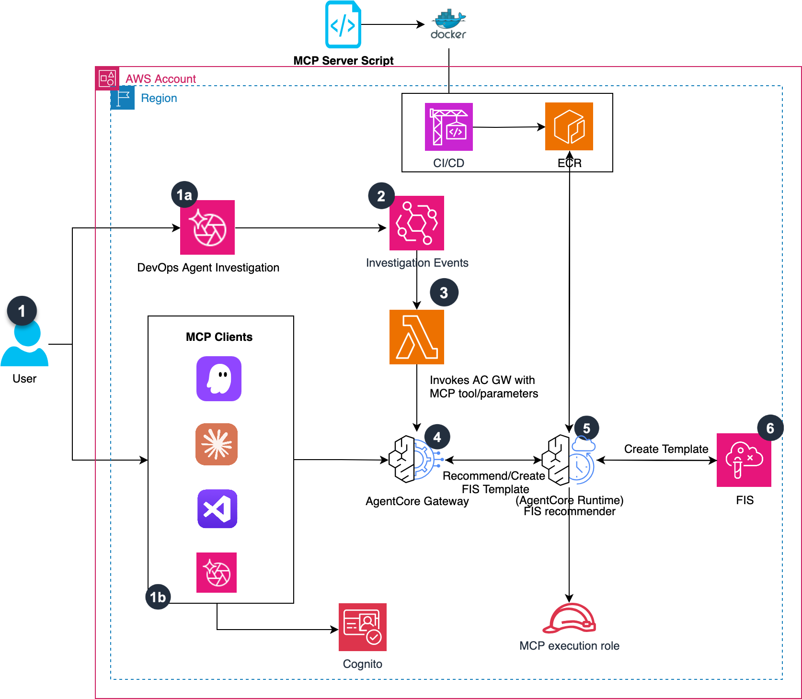

# Guidance for Enhancing Resilience with DevOps Agent and Fault Injection Simulator on AWS

Automatically recommend and generate AWS Fault Injection Simulator (FIS) chaos engineering experiments based on DevOps Agent findings using a Model Context Protocol (MCP) server deployed on Amazon Bedrock AgentCore.

## Table of Contents

1. [Overview](#overview)
    - [Architecture](#architecture)
    - [Cost](#cost)
2. [Prerequisites](#prerequisites)
    - [Operating System](#operating-system)
    - [AWS Account Requirements](#aws-account-requirements)
3. [Deployment Steps](#deployment-steps)
4. [Deployment Validation](#deployment-validation)
5. [Running the Guidance](#running-the-guidance)
6. [Next Steps](#next-steps)
7. [Cleanup](#cleanup)
8. [FAQ, Known Issues, and Limitations](#faq-known-issues-and-limitations)
9. [Notices](#notices)


## Overview

Teams using AWS DevOps Agent receive investigation findings about operational issues — network latency, database failures, CPU spikes, and more. Translating these findings into actionable chaos engineering experiments requires deep knowledge of AWS FIS actions, target configurations, and safety guardrails.

This guidance deploys an MCP server that:
- Analyzes DevOps Agent findings and recommends relevant FIS experiments
- Maps issues to appropriate fault injection actions across 50+ finding types
- Generates complete, ready-to-deploy FIS experiment templates with safety guardrails
- Integrates with DevOps Agent via Bedrock AgentCore, or runs as a standalone Lambda for EventBridge-driven automation

### Architecture



**Option 1: MCP Server (Interactive via DevOps Agent)**

1. User asks DevOps Agent to recommend FIS experiments for a finding
2. DevOps Agent calls the MCP server deployed on Amazon Bedrock AgentCore
3. MCP server analyzes the finding and returns experiment recommendations
4. User reviews and deploys the FIS experiment template

**Option 2: Lambda Client (Automated via EventBridge)**

1. DevOps Agent completes an investigation and emits an EventBridge event
2. EventBridge rule triggers a Lambda function
3. Lambda calls the MCP server via AgentCore to get recommendations
4. Results are published to an SNS topic for notification

### Cost

You are responsible for the cost of the AWS services used while running this Guidance. As of July 2025, the cost for running this Guidance with the default settings in US East (N. Virginia) is approximately **$5–15 per month** depending on usage volume.

We recommend creating a [Budget](https://docs.aws.amazon.com/cost-management/latest/userguide/budgets-managing-costs.html) through [AWS Cost Explorer](https://aws.amazon.com/aws-cost-management/aws-cost-explorer/) to help manage costs. Prices are subject to change. For full details, refer to the pricing webpage for each AWS service used in this Guidance.

| AWS Service | Dimensions | Cost [USD] |
| ----------- | ---------- | ---------- |
| Amazon Bedrock AgentCore | 1 runtime, ~1,000 invocations/month | ~$5.00/month |
| Amazon Cognito | 1 user pool, M2M token exchange | $0.00 |
| AWS Lambda | 1,000 invocations, 512 MB, 120s timeout | ~$1.00/month |
| Amazon SNS | 1,000 notifications/month | ~$0.50/month |
| Amazon EventBridge | 1,000 events/month | ~$0.01/month |
| AWS Secrets Manager | 1 secret, 1,000 API calls/month | ~$0.44/month |

## Prerequisites

### Operating System

These deployment instructions work on **macOS, Linux, and Windows**. All scripts are Python-based and fully cross-platform.

- Python 3.10+
- pip (Python package manager)
- AWS CLI v2, configured with credentials (`aws sts get-caller-identity`)
- [Bedrock AgentCore Starter Toolkit](https://pypi.org/project/bedrock-agentcore-starter-toolkit/)

```bash
pip install bedrock-agentcore-starter-toolkit
pip install -r source/requirements.txt
```

> **Windows Note:** Use [WSL](https://learn.microsoft.com/en-us/windows/wsl/install) or [Git Bash](https://git-scm.com/downloads) if needed for shell commands. If `agentcore configure` falls back to Container deployment ("zip utility not found"), install zip via `choco install zip` or `scoop install zip`.

### AWS Account Requirements

- IAM permissions to create: Cognito User Pools, Lambda functions, IAM roles, EventBridge rules, SNS topics, Secrets Manager secrets
- Amazon Bedrock AgentCore access enabled in your region
- AWS FIS permissions (for experiment template creation)

### Supported Regions

This guidance works best in **us-east-1** (N. Virginia). Bedrock AgentCore availability may vary by region.

## Deployment Steps

### Option 1: MCP Server (for DevOps Agent)

1. Clone the repo:
   ```bash
   git clone https://github.com/aws-solutions-library-samples/guidance-for-enhancing-resilience-with-devops-agent-and-fault-injection-simulator.git
   cd guidance-for-enhancing-resilience-with-devops-agent-and-fault-injection-simulator/source
   ```

2. Setup Cognito OAuth:
   ```bash
   python setup_cognito_fis.py
   ```
   Save the output values (Client ID, Client Secret, Discovery URL, Exchange URL).

3. Configure and deploy the MCP server to AgentCore:
   ```bash
   agentcore configure -e server.py --protocol MCP
   agentcore launch
   ```
   When prompted for OAuth, enter the Discovery URL and Client ID from step 2.

4. Get registration values:
   ```bash
   python show_registration_values.py
   ```

5. Register in DevOps Agent Console:
   - Go to Capability Providers → MCP Server → Register
   - Enter the Endpoint URL, Client ID, Client Secret, and Exchange URL from previous steps
   - Set Authorization Flow to **OAuth Client Credentials**
   - Set Scope to `default-fis-resource-server/read`

### Option 2: Lambda Client (for EventBridge automation)

1. Deploy the Lambda function:
   ```bash
   cd source
   python deploy_lambda.py
   ```

2. Setup EventBridge + SNS integration:
   ```bash
   python setup_eventbridge_cross.py
   ```

3. Wire EventBridge to Lambda (replace `ACCOUNT_ID`):
   ```bash
   aws events put-targets --rule DevOpsAgentFISRecommendations \
     --targets "Id=1,Arn=arn:aws:lambda:us-east-1:ACCOUNT_ID:function:fis-recommender-mcp-client" \
     --region us-east-1

   aws lambda add-permission --function-name fis-recommender-mcp-client \
     --statement-id eventbridge-invoke --action lambda:InvokeFunction \
     --principal events.amazonaws.com \
     --source-arn arn:aws:events:us-east-1:ACCOUNT_ID:rule/DevOpsAgentFISRecommendations \
     --region us-east-1
   ```

## Deployment Validation

- Verify AgentCore runtime is running:
  ```bash
  agentcore status
  ```
  You should see the runtime in `ACTIVE` state.

- Check runtime logs (replace `AGENT_ID`):
  ```bash
  aws logs tail /aws/bedrock-agentcore/runtimes/AGENT_ID-DEFAULT \
    --log-stream-name-prefix "$(date +%Y/%m/%d)/[runtime-logs]" \
    --since 10m --region us-east-1
  ```
  You should see `Uvicorn running on http://0.0.0.0:8000` and `200 OK` on PingRequests.

- Test Lambda deployment:
  ```bash
  echo '{"tool":"recommend_fis_experiments","arguments":{"finding":{"summary":"network latency"}}}' > payload.json
  aws lambda invoke --function-name fis-recommender-mcp-client --region us-east-1 \
    --payload fileb://payload.json response.json
  cat response.json
  ```

## Running the Guidance

### Ask DevOps Agent for recommendations

```
Recommend FIS experiments for network latency issues
```

The MCP server returns structured recommendations:
```json
{
  "recommendations": [
    {
      "action": "aws:network:disrupt-connectivity",
      "duration": "PT10M",
      "description": "Inject network latency"
    }
  ],
  "count": 1
}
```

### Supported Finding Types

| Category | Keywords | FIS Actions |
| -------- | -------- | ----------- |
| Network | network, latency, packet loss, vpc endpoint, cross-region | aws:network:disrupt-connectivity, aws:ecs:task-network-packet-loss |
| Database | database, rds, dynamodb, aurora dsql | aws:rds:reboot-db-instances, aws:rds:failover-db-cluster |
| Compute | cpu, memory, instance, spot, capacity | aws:ec2:stop-instances, aws:ssm:send-command |
| Containers | ecs, container cpu/memory/network, drain | aws:ecs:stop-task, aws:ecs:task-cpu-stress |
| Kubernetes | eks, pod cpu/memory/network, nodegroup | aws:eks:pod-delete, aws:eks:pod-cpu-stress |
| Lambda | lambda, lambda latency, lambda http | aws:lambda:invocation-error, aws:lambda:invocation-add-delay |
| Caching | elasticache, memorydb, kinesis | aws:elasticache:replicationgroup-interrupt-az-power |
| API | api throttle, api error, api unavailable | aws:fis:inject-api-throttle-error |

### Available MCP Tools

- **recommend_fis_experiments** — Analyzes a finding and returns experiment recommendations
- **create_fis_template** — Generates and deploys a complete FIS experiment template with safety guardrails (action allowlist, duration cap, required stop conditions, tag scoping)

### Local Development

Start the server locally:
```bash
cd source
python server.py
```

Test with the local MCP client:
```bash
python my_mcp_test.py
```

## Next Steps

- Add custom finding mappings by editing `FINDING_MAPPINGS` in `source/server.py`
- Integrate with CI/CD pipelines to run FIS experiments post-deployment
- Schedule regular chaos engineering game days using the generated templates
- Monitor experiment results and track resilience improvements over time
- Extend the MCP server with additional tools for experiment execution and result analysis

## Cleanup

Run the cleanup script to remove all deployed resources:

```bash
cd source
python cleanup.py
```

This removes:
- Cognito User Pool and domain
- Lambda function and IAM role
- AgentCore runtime
- Local config files (`.bedrock_agentcore.yaml`, `.fis_config.json`)

To clean up individual components manually:

```bash
# Remove AgentCore runtime
agentcore destroy --agent AGENT_NAME --force

# Remove Lambda
aws lambda delete-function --function-name fis-recommender-mcp-client --region us-east-1

# Remove EventBridge rule
aws events remove-targets --rule DevOpsAgentFISRecommendations --ids 1 --region us-east-1
aws events delete-rule --name DevOpsAgentFISRecommendations --region us-east-1
```

## FAQ, Known Issues, and Limitations

**Q: Can I use this without DevOps Agent?**
Yes. The MCP server works with any MCP-compatible client (Kiro CLI, Claude Desktop) or can be invoked directly via the Lambda client.

**Q: What if `agentcore deploy` fails with Docker Hub rate limits?**
The Dockerfile uses `public.ecr.aws/docker/library/python:3.13-slim` to avoid this. Retry the deploy if you see `429 Too Many Requests`.

**Q: How do I add support for new finding types?**
Edit `FINDING_MAPPINGS` in `source/server.py`. Use ISO 8601 duration format (e.g., `PT5M` for 5 minutes).

**Known Issues:**
- On Windows, if `agentcore configure` falls back to Container deployment, install `zip` via `choco install zip` or `scoop install zip`
- Bedrock AgentCore availability varies by region; us-east-1 is recommended

For feedback, questions, or suggestions, please use the [issues tab](https://github.com/aws-solutions-library-samples/guidance-for-enhancing-resilience-with-devops-agent-and-fault-injection-simulator/issues).

## Notices

*Customers are responsible for making their own independent assessment of the information in this Guidance. This Guidance: (a) is for informational purposes only, (b) represents AWS current product offerings and practices, which are subject to change without notice, and (c) does not create any commitments or assurances from AWS and its affiliates, suppliers or licensors. AWS products or services are provided "as is" without warranties, representations, or conditions of any kind, whether express or implied. AWS responsibilities and liabilities to its customers are controlled by AWS agreements, and this Guidance is not part of, nor does it modify, any agreement between AWS and its customers.*

